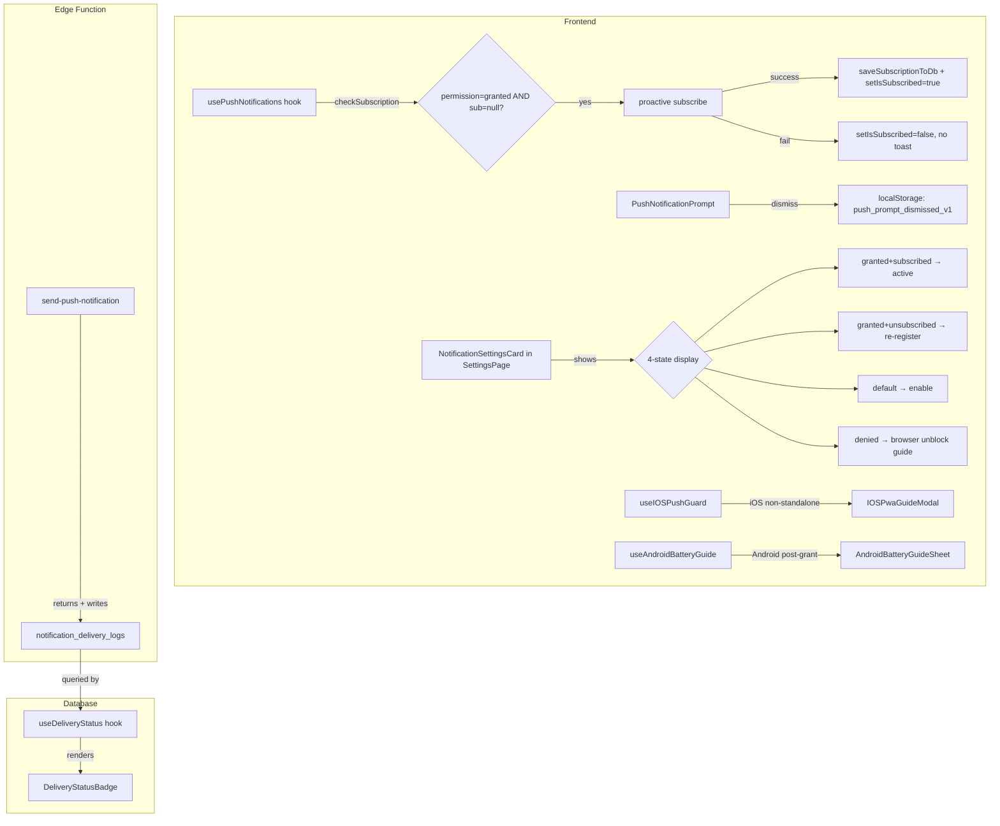

# Design Document — Push Notifications Offline Delivery (Bugfix)

## Overview

This document covers the technical design for fixing five interconnected axes of unreliable push notification delivery in the school management application. The fixes target the **client-side UX layer** (prompt management, platform guidance) and the **data layer** (delivery status persistence and proactive re-registration), without altering the already-corrected Edge Function or Service Worker logic.

| # | Axis | Root Cause | Fix |
|---|------|-----------|-----|
| 1 | Prompt & Settings | Dismissal stored in `sessionStorage` only; no persistent settings view; no `denied` guidance | Migrate to `localStorage`, add full notification settings card |
| 2 | iOS Safari non-PWA | Push silently fails; no Add-to-Home-Screen guidance | Detect iOS non-standalone before `subscribe()`, show guidance modal |
| 3 | Android Battery Optimization | No guidance after successful subscribe on Android | Show dismissible guidance sheet post-grant on Android |
| 4 | Delivery diagnosis | Edge Function response is discarded; senders never see delivery status | Store delivery result in `notification_delivery_logs`; render badge for senders |
| 5 | Expired subscriptions | `checkSubscription` only sets `isSubscribed=false` when sub is null+granted | Attempt proactive re-registration silently when `permission='granted'` but sub is `null` |

---

## Glossary

| Term | Definition |
|------|-----------|
| **Push Subscription** | Object containing endpoint URL and encryption keys issued by the browser when push is enabled; stored in `push_subscriptions` table |
| **VAPID Keys** | Public/private key pair used to authenticate the push server with FCM/APNS |
| **Service Worker (SW)** | `sw.js` runs in the background and receives push events even when the app is closed |
| **PWA mode** | Running the app from the iOS home screen (not directly from Safari browser) |
| **Doze Mode** | Android power-saving mode that defers background tasks and restricts FCM |
| **Battery Optimization** | Android setting that limits app background activity, directly affecting push delivery |
| **410 Gone** | HTTP status returned by push service meaning the subscription has permanently expired |
| **3-strike rule** | Edge Function logic: keep subscription on transient 403 failures; delete after 3 consecutive failures |
| **delivery status** | Result of a push send attempt: `{ sent, total, has_active_subscription, no_device_registered }` |
| **proactive re-registration** | Silently calling `pushManager.subscribe()` on app load when `permission='granted'` but subscription is `null` |

---

## Bug Details

### Axis 1 — Prompt management

The `PushNotificationPrompt` component stores dismissal in `sessionStorage` under key `push_prompt_dismissed`. This means:
- If the user closes the tab and opens a new one, the prompt reappears (sessionStorage is cleared per-tab/session).
- If the same tab stays open, the prompt stays hidden — inconsistent behavior within the same browser.
- There is no settings UI showing the current notification state (`granted`/`default`/`denied`/unsubscribed), so a user who dismissed the prompt can never re-enable notifications without going to browser settings directly.
- When `Notification.permission === 'denied'`, the component silently disappears with no guidance on how to unblock.

### Axis 2 — iOS Safari without PWA

Web Push is not available in iOS Safari unless the app is installed to the home screen (PWA/standalone mode). Currently:
- `subscribeToNotifications()` attempts `pushManager.subscribe()` regardless of platform.
- On non-standalone iOS Safari, either `PushManager` is absent (`'PushManager' in window === false`) or `subscribe()` throws an `AbortError`.
- The error is caught and shows a generic Arabic error toast; there is no guidance to add the app to the home screen.

### Axis 3 — Android Doze / Battery Optimization

On Android devices — especially Chinese OEM devices (Xiaomi/MIUI, Huawei/EMUI, Samsung One UI) — aggressive battery optimization can defer or suppress push notifications for hours. Currently:
- After a successful permission grant, no guidance is shown to the user to exempt the app.
- Users who experience delayed notifications have no context for why or how to fix it.

### Axis 4 — Missing delivery diagnosis

The Edge Function `send-push-notification` returns a detailed delivery response body:
```json
{ "success": true, "sent": 1, "total": 2, "has_active_subscription": true, "no_device_registered": false, ... }
```
Currently this response is:
- Discarded when the push is triggered from a PostgreSQL trigger via `net.http_post`.
- Not stored in any table.
- Not surfaced in any UI for admins or teachers.

Teachers and admins who send messages cannot tell whether the recipient has push notifications enabled.

### Axis 5 — Expired subscriptions

The `checkSubscription` function handles VAPID key mismatches correctly (resubscribes silently), but handles the case `permission='granted'` + `getSubscription()=null` incorrectly:

```typescript
// Current code — Case 2 only sets state, does not attempt re-registration
if (!subscription) {
  setIsSubscribed(false);
  return;
}
```

This happens when:
1. The push service returned a `410 Gone` for the subscription, causing the Edge Function to delete it from `push_subscriptions`.
2. The browser's own subscription record expired independently.
3. The user cleared site data but kept notification permission.

After this event, the user silently receives no push notifications even though their browser permission is `'granted'`, and they see no indication that anything is wrong.

---

## Expected Behavior

**Axis 1:**
- Dismissal is stored in `localStorage` under key `push_prompt_dismissed_v1` so it persists across sessions.
- The Settings page shows a `NotificationSettingsCard` that renders one of four states based on `(permission, isSubscribed)`.
- When `permission === 'denied'`, browser-specific unblock instructions are shown.

**Axis 2:**
- When iOS non-standalone is detected, tapping "تفعيل الإشعارات" shows an `IOSPwaGuideModal` with Add-to-Home-Screen steps instead of attempting `pushManager.subscribe()`.
- When iOS PWA (standalone) mode is active, push subscription works normally.

**Axis 3:**
- After a successful permission grant on Android, an `AndroidBatteryGuideSheet` is shown once with OEM-specific battery exemption steps.
- The user can dismiss permanently ("لا تسألني مجدداً") which stores `battery_guidance_dismissed_v1` in `localStorage`.

**Axis 4:**
- The Edge Function writes the delivery result to `notification_delivery_logs` when a `notification_id` is present in the request.
- Admins and teachers see a `DeliveryStatusBadge` next to messages where `no_device_registered=true` and `has_active_subscription=false`.
- No badge appears for temporary outages (`temporary_outage=true`).

**Axis 5:**
- `checkSubscription` attempts `pushManager.subscribe()` silently when `permission='granted'` and `getSubscription()` returns `null`.
- On success, `isSubscribed` is set to `true` and the new endpoint is saved to DB.
- On failure (any reason), `isSubscribed` is set to `false` with no user-visible error.

---

## Hypothesized Root Cause

All five axes share the same underlying pattern: **missing state persistence or missing state transitions**.

1. `sessionStorage` is inherently session-scoped — using it for a user preference that should survive browser restarts was an incorrect choice of storage primitive.
2. Platform capability checks (`PushManager in window`, `display-mode: standalone`) were not performed before calling `subscribe()`, so the API failure was treated as a generic error rather than a structural prerequisite.
3. The `subscribeToNotifications` success path had no post-grant hook to trigger platform-specific guidance.
4. The Edge Function was designed as a delivery-only service — storing the delivery outcome was never added to the contract between the Edge Function and the calling DB trigger.
5. The `null` subscription case in `checkSubscription` was treated as "user hasn't subscribed" rather than "user's subscription was lost", so the re-registration path was never triggered.

---

## Fix Implementation

### Architecture



### Components and Interfaces

#### 1. `usePushNotifications` — Axis 5

**File:** `src/hooks/usePushNotifications.ts`

Add proactive re-registration branch in `checkSubscription` after the current Case 2:

```typescript
// Case 2 extended: permission granted but browser subscription is null → re-register silently
if (!subscription && Notification.permission === 'granted' && VAPID_PUBLIC_KEY) {
  try {
    logger.log('[Push] Proactive re-registration: granted+null → re-subscribing silently');
    const newSub = await registration.pushManager.subscribe({
      userVisibleOnly: true,
      applicationServerKey: urlBase64ToUint8Array(VAPID_PUBLIC_KEY),
    });
    const saved = await saveSubscriptionToDb(user.id, newSub);
    setIsSubscribed(saved);
    if (saved) logger.log('[Push] Proactive re-registration succeeded');
  } catch (err) {
    logger.warn('[Push] Proactive re-registration failed (silent):', err);
    setIsSubscribed(false);
  }
  return;
}
```

Also add `unsubscribeFromNotifications()` to the return value for the settings card:

```typescript
const unsubscribeFromNotifications = async (): Promise<void> => {
  try {
    const registration = await navigator.serviceWorker.ready;
    const subscription = await registration.pushManager.getSubscription();
    if (subscription) {
      await subscription.unsubscribe();
      await supabase.from('push_subscriptions').delete().eq('endpoint', subscription.endpoint);
    }
    setIsSubscribed(false);
  } catch (err) {
    logger.warn('[Push] Unsubscribe failed:', err);
  }
};
```

#### 2. `PushNotificationPrompt` — Axis 1

**File:** `src/components/PushNotificationPrompt.tsx`

Replace all `sessionStorage` references with `localStorage` and the versioned key:

```typescript
// Before
sessionStorage.setItem('push_prompt_dismissed', 'true');
sessionStorage.getItem('push_prompt_dismissed') === 'true'

// After
localStorage.setItem('push_prompt_dismissed_v1', 'true');
localStorage.getItem('push_prompt_dismissed_v1') === 'true'
```

#### 3. `NotificationSettingsCard` — Axis 1 (new component)

**File:** `src/components/NotificationSettingsCard.tsx`

```typescript
interface NotificationSettingsCardProps {
  permission: NotificationPermission;
  isSubscribed: boolean;
  onSubscribe: () => Promise<boolean>;
  onUnsubscribe: () => Promise<void>;
}
```

Browser detection helper (inline, no external dependency):

```typescript
function detectBrowser(): 'chrome' | 'safari' | 'firefox' | 'other' {
  const ua = navigator.userAgent;
  if (/Chrome/.test(ua) && !/Edg/.test(ua)) return 'chrome';
  if (/Safari/.test(ua) && !/Chrome/.test(ua)) return 'safari';
  if (/Firefox/.test(ua)) return 'firefox';
  return 'other';
}
```

State matrix:

| `permission` | `isSubscribed` | Rendered UI |
|---|---|---|
| `'granted'` | `true` | ✓ "مفعّلة" badge + "تعطيل" button |
| `'granted'` | `false` | ⚠ "يجب إعادة التسجيل" + "تفعيل" button |
| `'default'` | any | ○ "غير مفعّلة" + "تفعيل الآن" button |
| `'denied'` | any | ✗ "محظورة" + browser-specific unblock text |

Integrated into `SettingsPage.tsx` replacing the existing basic push button row.

#### 4. `useIOSPushGuard` + `IOSPwaGuideModal` — Axis 2

**File:** `src/hooks/useIOSPushGuard.ts`

```typescript
export function useIOSPushGuard() {
  const isIOS = /iP(hone|od|ad)/.test(navigator.userAgent);
  const isStandalone = window.matchMedia('(display-mode: standalone)').matches
    || (window.navigator as any).standalone === true;

  return {
    needsIOSGuidance: isIOS && !isStandalone,
    isIOSPWA: isIOS && isStandalone,
  };
}
```

**File:** `src/components/IOSPwaGuideModal.tsx`

Uses the existing `Dialog` from `@radix-ui/react-dialog`. Shows:
1. Share icon (Safari) → "إضافة إلى الشاشة الرئيسية"
2. Menu icon (for context) → "Add to Home Screen"
3. Then reopen the app from the home screen icon

The modal is shown by `subscribeToNotifications()` when `needsIOSGuidance` is true; the subscription attempt is aborted (returns `false`).

#### 5. `useAndroidBatteryGuide` + `AndroidBatteryGuideSheet` — Axis 3

**File:** `src/hooks/useAndroidBatteryGuide.ts`

```typescript
const KEY = 'battery_guidance_dismissed_v1';

export function useAndroidBatteryGuide() {
  const isAndroid = /Android/.test(navigator.userAgent);
  const [showSheet, setShowSheet] = useState(false);

  const onPermissionGranted = useCallback(() => {
    if (!isAndroid) return;
    if (localStorage.getItem(KEY) !== 'true') setShowSheet(true);
  }, [isAndroid]);

  const dismiss = useCallback((permanent: boolean) => {
    if (permanent) localStorage.setItem(KEY, 'true');
    setShowSheet(false);
  }, []);

  return { showBatteryGuide: showSheet, onPermissionGranted, dismiss };
}
```

`subscribeToNotifications()` calls `onPermissionGranted()` after `permission === 'granted'` is confirmed.

**File:** `src/components/AndroidBatteryGuideSheet.tsx`

Uses existing `Sheet` component (bottom drawer). Shows OEM-specific paths:
- Samsung: Settings → Device Care → Battery → "Never sleeping apps"  
- Xiaomi/MIUI: Settings → Apps → Manage apps → [app] → Battery Saver → No restrictions  
- Huawei/EMUI: Settings → Battery → App launch → Manual manage  
- Generic: Settings → Apps → [app] → Battery → Unrestricted  

Buttons: "فهمت، شكراً" (close only) and "لا تسألني مجدداً" (close + persist).

#### 6. Delivery Status — Axis 4

##### 6a. Database migration

**File:** `supabase/migrations/20260822000000_add_notification_delivery_logs.sql`

```sql
CREATE TABLE IF NOT EXISTS public.notification_delivery_logs (
  id                      uuid PRIMARY KEY DEFAULT gen_random_uuid(),
  notification_id         uuid REFERENCES public.notifications(id) ON DELETE CASCADE,
  sent_count              integer NOT NULL DEFAULT 0,
  total_subscriptions     integer NOT NULL DEFAULT 0,
  has_active_subscription boolean NOT NULL DEFAULT false,
  no_device_registered    boolean NOT NULL DEFAULT false,
  temporary_outage        boolean NOT NULL DEFAULT false,
  delivered_at            timestamptz NOT NULL DEFAULT now(),
  raw_response            jsonb
);

ALTER TABLE public.notification_delivery_logs ENABLE ROW LEVEL SECURITY;

CREATE POLICY "privileged_read_delivery_logs"
  ON public.notification_delivery_logs FOR SELECT
  USING (
    EXISTS (
      SELECT 1 FROM public.notifications n
      JOIN public.user_roles r ON r.user_id = auth.uid()
      WHERE n.id = notification_delivery_logs.notification_id
        AND r.role IN ('admin', 'teacher')
    )
  );

CREATE POLICY "service_insert_delivery_logs"
  ON public.notification_delivery_logs FOR INSERT
  WITH CHECK (auth.role() = 'service_role');

CREATE INDEX idx_delivery_logs_notification_id
  ON public.notification_delivery_logs(notification_id);
```

##### 6b. Edge Function update

**File:** `supabase/functions/send-push-notification/index.ts`

After the existing `console.log` delivery summary (before `return jsonResponse`), add:

```typescript
if (notification_id) {
  try {
    await supabase.from('notification_delivery_logs').insert({
      notification_id,
      sent_count: sent,
      total_subscriptions: total,
      has_active_subscription: sent > 0 || transientFailures > 0,
      no_device_registered: noActiveSubscriptionsAtAll,
      temporary_outage: allAttemptsFailedTemporarily,
      raw_response: responseBody,
    });
  } catch (logErr) {
    console.warn('[Push] Delivery log write failed (non-fatal):', logErr);
  }
}
```

##### 6c. `useDeliveryStatus` hook

**File:** `src/hooks/useDeliveryStatus.ts`

```typescript
export function useDeliveryStatus(notificationId: string | null | undefined) {
  return useQuery({
    queryKey: ['delivery-status', notificationId],
    enabled: !!notificationId,
    queryFn: async () => {
      const { data } = await supabase
        .from('notification_delivery_logs')
        .select('sent_count, has_active_subscription, no_device_registered, temporary_outage')
        .eq('notification_id', notificationId!)
        .maybeSingle();
      return data ?? null;
    },
    staleTime: 1000 * 60 * 5,
  });
}
```

##### 6d. `DeliveryStatusBadge` component

**File:** `src/components/DeliveryStatusBadge.tsx`

```typescript
interface DeliveryStatusBadgeProps {
  notificationId: string;
  isPrivileged: boolean; // true only for admin/teacher roles
}
```

Badge visibility rule:

```
show badge ⟺ isPrivileged=true
           ∧ no_device_registered=true
           ∧ has_active_subscription=false
           ∧ temporary_outage=false
```

No badge is rendered for loading state, temporary outages, successful deliveries, or non-privileged users.

### Data Models

#### `notification_delivery_logs` table

| Column | Type | Description |
|--------|------|-------------|
| `id` | uuid PK | Auto-generated |
| `notification_id` | uuid FK | References `notifications.id` (CASCADE DELETE) |
| `sent_count` | integer | Subscriptions successfully delivered |
| `total_subscriptions` | integer | Total subscriptions attempted |
| `has_active_subscription` | boolean | True if ≥1 device could receive |
| `no_device_registered` | boolean | True if user never subscribed |
| `temporary_outage` | boolean | True if all failures were transient |
| `delivered_at` | timestamptz | Timestamp of delivery attempt |
| `raw_response` | jsonb | Full Edge Function response for debugging |

#### `localStorage` keys

| Key | Value | Purpose |
|-----|-------|---------|
| `push_prompt_dismissed_v1` | `'true'` | Replaces `sessionStorage` — persists prompt dismissal |
| `battery_guidance_dismissed_v1` | `'true'` | Android battery guide permanent dismiss |

---

## Correctness Properties

*A property is a characteristic or behavior that should hold true across all valid executions of a system — essentially, a formal statement about what the system should do. Properties serve as the bridge between human-readable specifications and machine-verifiable correctness guarantees.*

These tests use **`@fast-check/vitest`** (minimum 100 iterations per property). Each test is tagged with: `Feature: push-notifications-offline-delivery, Property <number>: <description>`.

---

### Property 1: Delivery log storage round-trip

*For any* valid Edge Function delivery response object (with arbitrary combinations of `sent_count ≥ 0`, `total_subscriptions ≥ 0`, `has_active_subscription`, `no_device_registered`, `temporary_outage`), writing it to `notification_delivery_logs` and reading it back produces a row whose fields exactly match the original values.

**Validates: Requirements 2.9**

---

### Property 2: Delivery status badge visibility is a pure function of status

*For any* delivery status object `{ sent_count, has_active_subscription, no_device_registered, temporary_outage }`, the `DeliveryStatusBadge` should display the "لم يفعّل الإشعارات" badge **if and only if** `no_device_registered === true AND has_active_subscription === false AND temporary_outage === false` — regardless of the specific numeric value of `sent_count` or `total_subscriptions`.

**Validates: Requirements 2.10, 2.11**

---

## Error Handling

| Scenario | Handling |
|----------|----------|
| Proactive re-registration fails (permission revoked mid-check) | Silent: `setIsSubscribed(false)`, console warning only |
| Delivery log INSERT fails in Edge Function | Non-fatal `console.warn`; HTTP response is unchanged |
| `notification_delivery_logs` RLS blocks read for non-privileged user | Hook returns `null`; badge silently does not render |
| iOS `pushManager.subscribe()` throws with guidance modal already open | Modal shown; `subscribeToNotifications` returns `false` silently |
| Android battery guide `localStorage` write fails (private browsing) | `try/catch` suppresses; sheet still closes normally |
| `useDeliveryStatus` query fails | Badge does not render (graceful degradation) |
| `unsubscribeFromNotifications` fails | Console warning only; `isSubscribed` still set to `false` |

---

## Testing Strategy

### Property Tests (fast-check, min 100 iterations each)

**PBT Test for Property 1 (delivery log round-trip):**
Generate `fc.record({ sent_count: fc.nat(), total_subscriptions: fc.nat(), has_active_subscription: fc.boolean(), no_device_registered: fc.boolean(), temporary_outage: fc.boolean() })`. Insert via mock Supabase client. Read back. Assert fields match.

**PBT Test for Property 2 (badge visibility pure function):**
Generate `fc.record({ sent_count: fc.nat(), has_active_subscription: fc.boolean(), no_device_registered: fc.boolean(), temporary_outage: fc.boolean() })` with `isPrivileged=true`. Render `DeliveryStatusBadge`. Assert badge visible iff `no_device_registered && !has_active_subscription && !temporary_outage`.

### Unit / Example Tests (Vitest + @testing-library/react)

**`PushNotificationPrompt`**
- Dismiss action writes `push_prompt_dismissed_v1` to `localStorage`, not `sessionStorage`
- Component hidden on mount when `localStorage` key is present

**`NotificationSettingsCard`** — one test per state:
- `granted + subscribed` → "مفعّلة" badge + disable button
- `granted + unsubscribed` → re-register warning + enable button
- `default` → enable button
- `denied + Chrome UA` → Chrome-specific unblock instructions
- `denied + Safari UA` → Safari-specific unblock instructions
- `denied + Firefox UA` → Firefox-specific unblock instructions

**`usePushNotifications` — proactive re-registration**
- `permission='granted'` + `getSubscription()=null` → `pushManager.subscribe()` called
- On success → DB upsert called + `isSubscribed=true`
- On failure → no toast + `isSubscribed=false`
- VAPID key mismatch path unchanged (regression)

**`useIOSPushGuard`**
- iOS UA + non-standalone → `needsIOSGuidance=true`
- iOS UA + standalone → `needsIOSGuidance=false`
- Non-iOS UA → `needsIOSGuidance=false`

**`AndroidBatteryGuideSheet`**
- Appears after permission grant on Android UA
- "لا تسألني مجدداً" writes `battery_guidance_dismissed_v1` to `localStorage`
- Does not appear if `battery_guidance_dismissed_v1` already in `localStorage`

**`DeliveryStatusBadge`**
- Does not render when `isPrivileged=false`
- Does not render when `temporary_outage=true`
- Does not render when `sent_count > 0`
- Renders badge when `no_device_registered=true, has_active_subscription=false, temporary_outage=false, isPrivileged=true`

### Regression Tests

- `subscribeToNotifications()` happy path unaffected (Req 3.1)
- VAPID mismatch auto-resubscribe path unaffected (Req 3.3)
- 3-strike rule in Edge Function unaffected (Req 3.6)
- In-app `RealtimeNotificationsManager` unaffected (Req 3.7)
